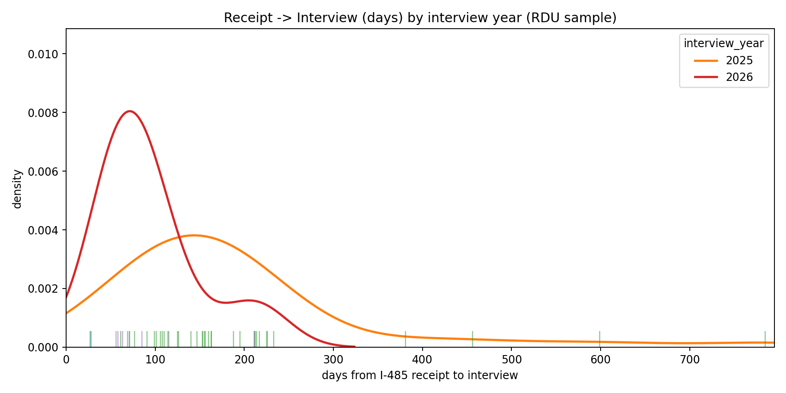
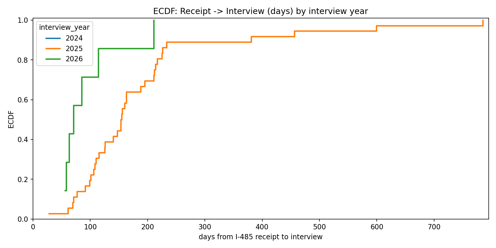
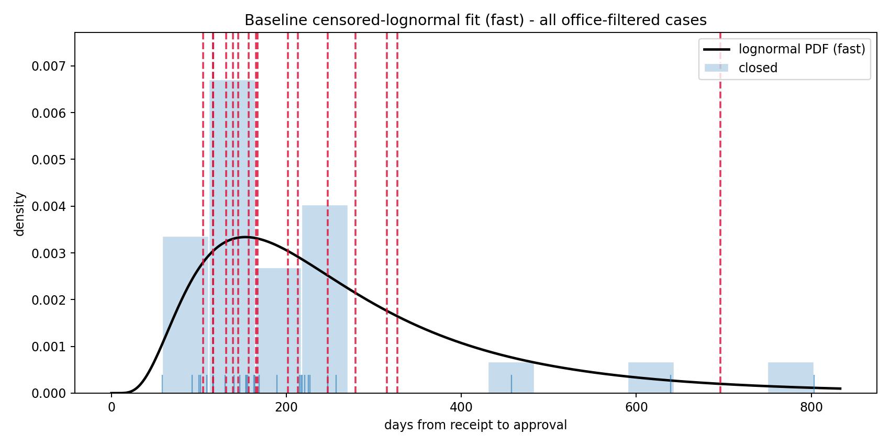

This page is the raw artifact index for the latest published snapshot. For a reader-facing interpretation, start with [Research Question and Scope](research-question.md), [Key Findings](key-findings.md), and [Pending Cases and Forecasts](pending-cases.md).

Artifacts on this page are served from `docs/results/latest/` and are regenerated by the publish workflow.

## Total Time (Receipt -> I-485)

## Interview -> I-485

## Descriptive Plots

## Fit Diagnostics

## Data Exports

- Manifest: [results/latest/manifest.json](results/latest/manifest.json)
- Filtered dataset: [results/latest/processed/dataset_filtered.csv](results/latest/processed/dataset_filtered.csv)

## Pending Predictions

CSV: [results/latest/tables/pending_predictions.csv](results/latest/tables/pending_predictions.csv)

The pending prediction table covers all pending office-filtered cases with a known receipt date, rather than a fixed receipt-year subset.
