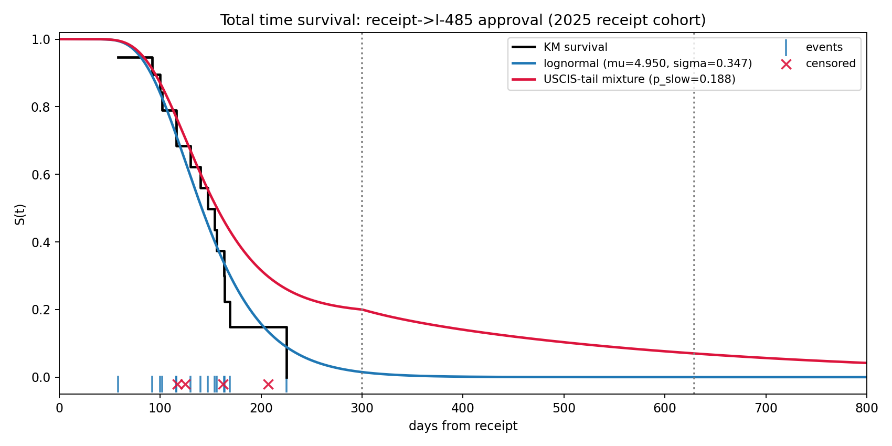
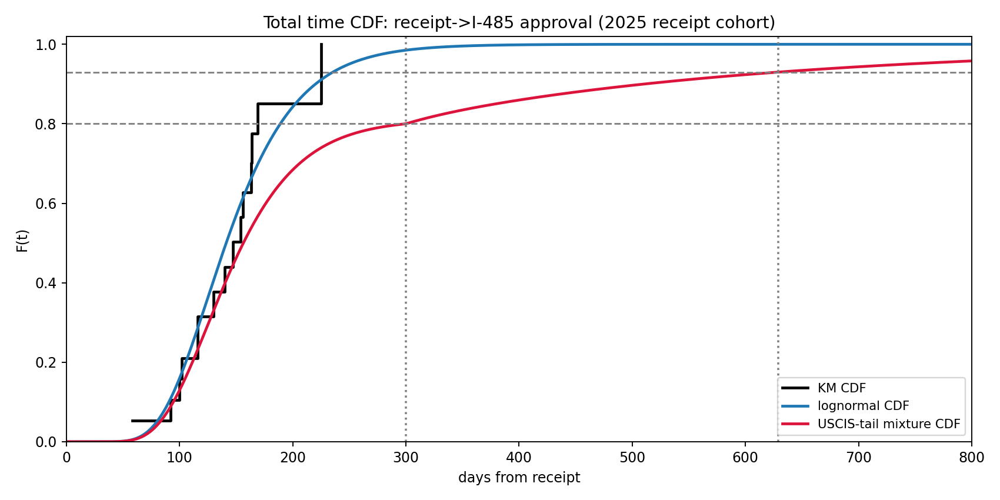
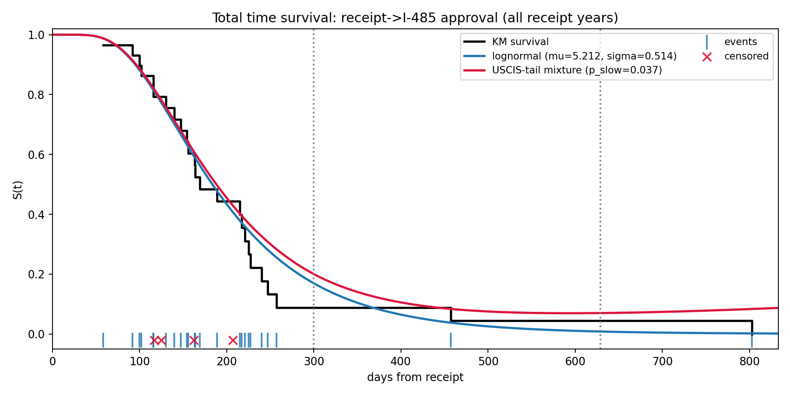
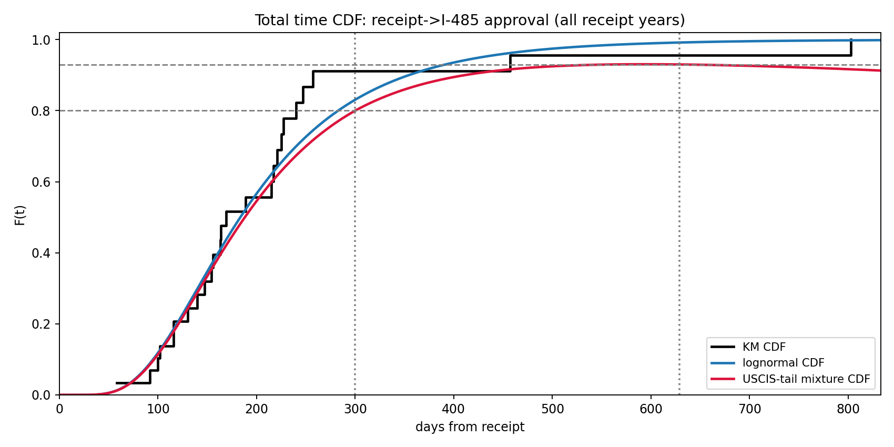
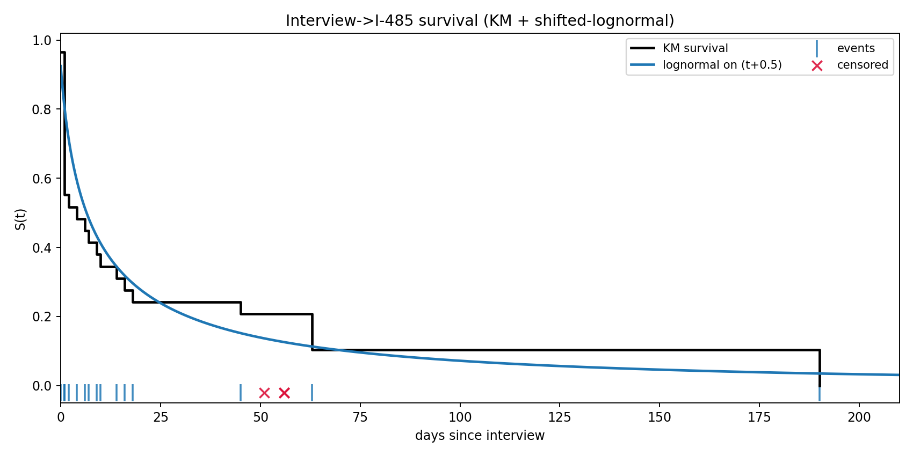
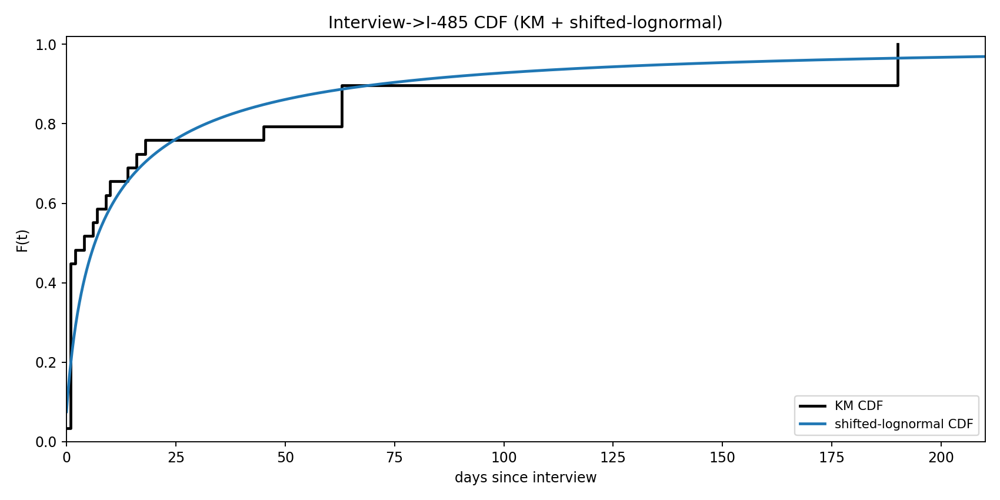
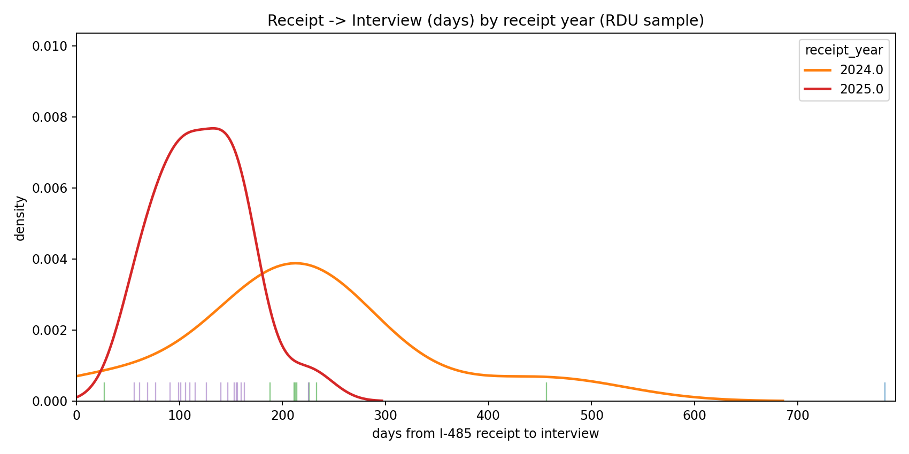
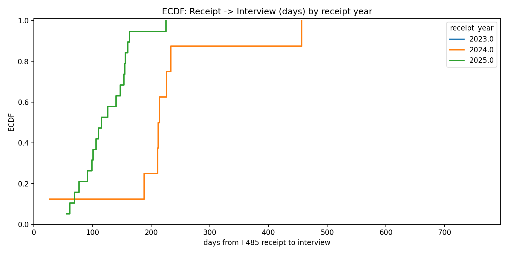
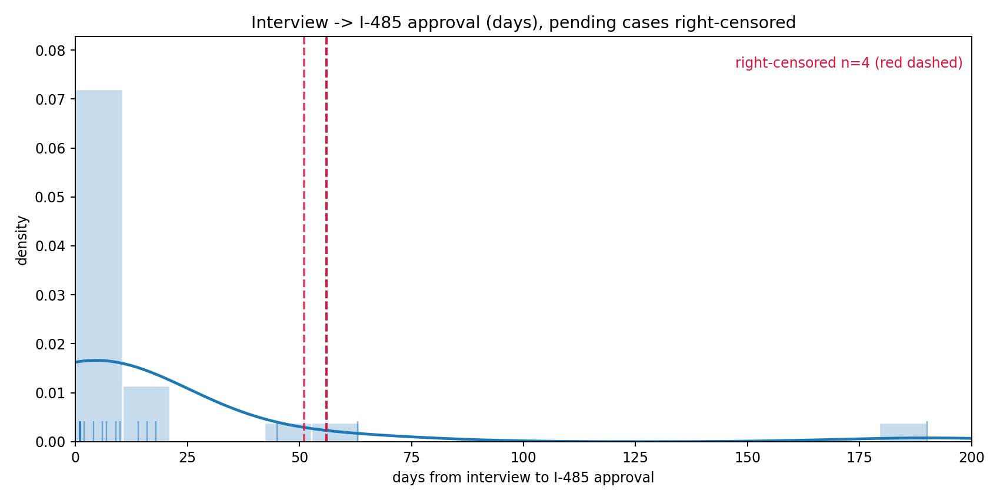
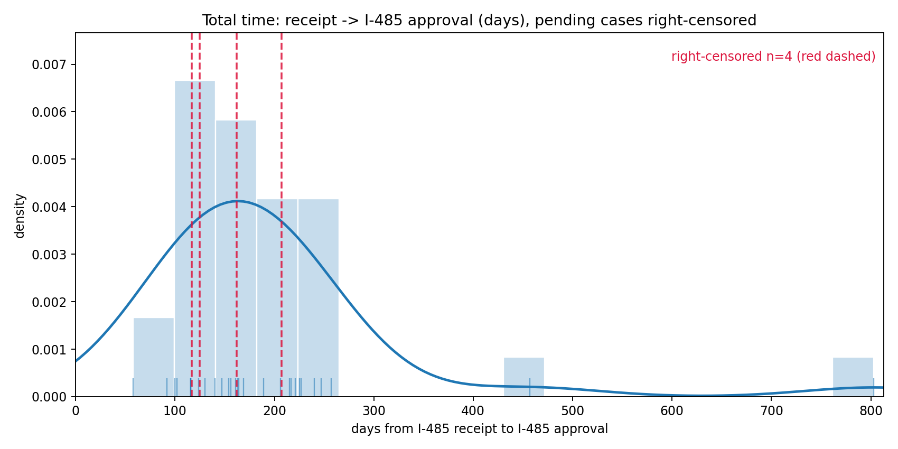

# Current Results

Artifacts on this page are served from `docs/results/latest/` and are regenerated by the publish workflow.

## Total Time (Receipt -> I-485)

## Interview -> I-485

## Descriptive Plots

## Pending Predictions

CSV: [results/latest/tables/pending_predictions.csv](results/latest/tables/pending_predictions.csv)
